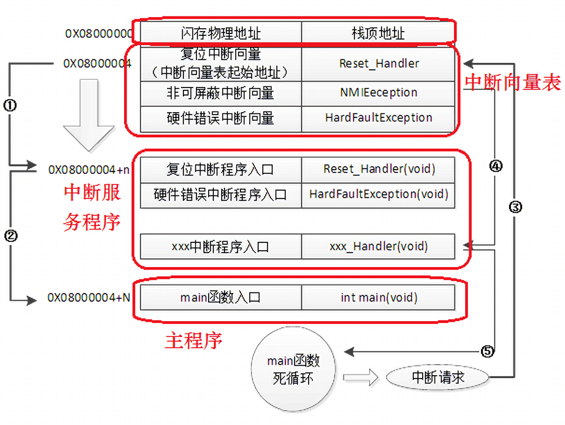
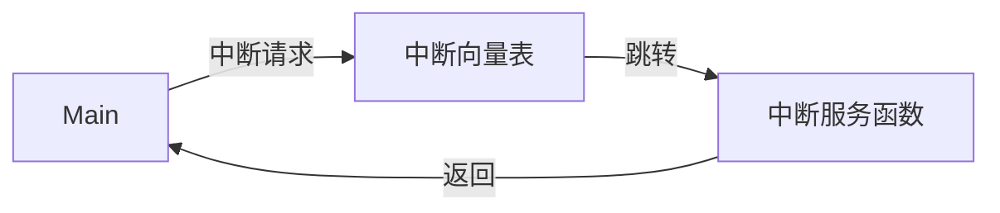
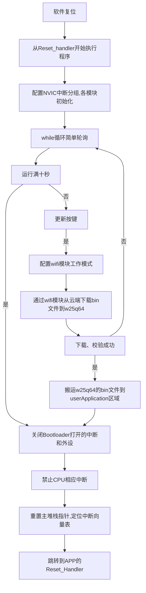

# bootloader流程
- 核心：重设msp指针、中断向量表重映射、内存拷贝、跳转至应用程序

| 参考教程 ：
[个人认为最详细以及最实用的bootloader教程](https://www.bilibili.com/video/BV161421b75G?spm_id_from=333.788.videopod.sections&vd_source=c41c6f6f4b05ff6aa9cae49053194c75)

优化点：
- 关于spiflash的优化：
  1. bin文件的crc校验，确保程序无误才进行跳转
  2. 进行分包传输处理，使得spi不在串口中断中进行，而在另外一个任务中进行

# 学习
| arm内核有四种寄存器：通用寄存器、程序计数器PC、链接寄存器LR、堆栈指针SP
## 1. STM32基础启动流程
  
1. 内核初始化
   1. 内核复位和NVIC寄存器清零，外设复位
   2. 设置主堆栈指针（SP_main）
   3. 设置PC和LR寄存器
      1. LR复位
      2. 把PC指针指向复位中断向量，指向reset_handler，然后跳转到reset_handler
2. Reset_handler
   1. SystemInit，初始化时钟、配置中断向量表
3. 调用__main，初始化C运行环境，包括栈指针、全局变量、调用main函数
4. 跳转到main函数中运行

## 2. 中断调用流程





## 3. 使用IAP方案的内部FLASH分配

| IAP：in application programming 程序内编程，代指在运行中升级
- ota是一种升级的方式 over the air，特指无线传输的方式进行升级，其依赖于IAP技术，而IAP技术需要特定的bootloader固件
![[PixPin_2025-09-26_10-46-09.png]]
在IAP方案中flash被分为两个部分（Bootloader + Application）
- Bootloader部分位于程序首段，负责检查版本、固件，在校验无误后便会设置新的栈顶指针、新的中断向量表，跳转到Application程序的复位函数reset，后面再也不会回到bootloader段

### 上电流程

1. 上电后就在bootloader段，仍然从0x8000004中取出复位中断向量地址，执行Reset_handler
2. booloader的main函数执行完后跳转到application段的Reset_handler中运行
3. IAP段和APP段两个运行环境完全隔离

### 双区OTA

1. 新固件和老固件各占其中一块bank，bootloader在bank0，老固件在bank1，新固件在bank2
2. 升级的时候，先把bin文件下载到bank2，只有当新固件下载完成并校验成功后，系统才会跳入IAP程序，
3. IAP程序会首先擦除老固件所在的bank1，把bank2的新固件拷贝到bank1中（如果使用后台静默升级的方式，则必须使用该方式进行升级）
4. 单区ota则是直接下载到bank1，**但很可能会变砖**
- 注意：这个bank2可以是外置的flash/emmc等可存储设备，并不一定要在stm32内部flash
- 同时复制到stm32也不一定要在flash中，也可以在sram中等，实现快速运行


## 4. 实操


### 1. 确定分区大小

- arm的flash中具有不同的页，有不同的页大小（1k、4K、16K、64K等），需要使用整数的页数量![[PixPin_2025-09-26_11-04-01.png]]
- STM32F103C8T6内部FLASH起始地址0800 0000，容量64KB，每页1KB，地址字长32bit，数据宽度8bit，页内地址是低位10bit，页号是页内地址左侧6bit。

| 分区              | 容量   | 地址          | 页号  | 地址          | 页号  |
| --------------- | ---- | ----------- | --- | ----------- | --- |
| BootLoader      | 20Kb | 0x0800 0000 | 0   | 0x0800 4C00 | 19  |
| UserApplication | 43Kb | 0x0800 5000 | 20  | 0x0800 F800 | 62  |
| UserData        | 1Kb  | 0x0800 FC00 | 63  |             |     |
使用w25q64实现双区OTA
w25q64
- 每块64KB，每个扇区4KB，每个页256B
- 我们要设置48KB，也就是12个扇区，0x00000 - 0x00B000

```c 
#define START_ADDRESS 0x08005000   // 内部Flash的用户应用开始地址 32bit
#define REPO_ADDRESS  0x000000     // 外部W25Q64的存储开始地址 24bit
#define USER_DATA     0x0800FC00    // 分配给数据存储的区域的起始地址
```



- 注意在跳转之前要把bootloader打开的中断和外设都关上，以免影响userApplication运行

- 设置向量表、开启中断、外设等都有对应的api

### 2. 获取bin文件
获取了bin文件后存到内置、外置的flash中，一般在bin文件之前会先发送该bin文件有多大，也会有crc校验码，所以需要比较大小、crc

同时要注意使用串口接收的时候，避免使用空闲中断让程序误以为传输结束，开启定时器，每接受到一个程序就清零该定时器，当定时器溢出时候代表传输完成